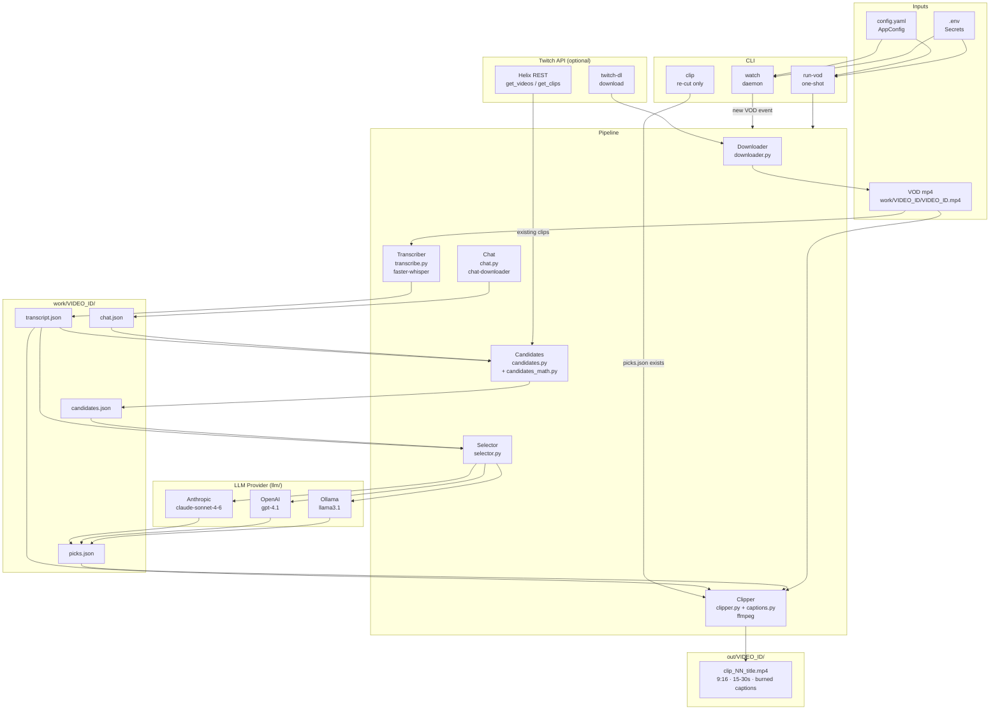

# Clipsmith Architecture

## Overview

Clipsmith turns a Twitch VOD into a set of 9:16 vertical clips with burned-in Spanish captions, ready for TikTok / YouTube Shorts. The pipeline has two entry points: a continuous **watcher** (daemon) that polls Twitch for new VODs, and a one-shot **run-vod** command for manual runs. Both feed the same five-stage pipeline.

---

## Pipeline Stages

```
VOD (mp4)
    │
    ▼
[1] Transcribe ──────────────── faster-whisper (Spanish, CPU int8)
    │ transcript.json            864 segments, word timestamps
    │
    ▼
[2] Chat Download ──────────── chat-downloader (Twitch replay API)
    │ chat.json                  raw messages → ChatMessage (time, author, emotes)
    │                            fallback: evenly-spaced transcript samples
    │
    ▼
[3] Candidate Scoring ────────  three signals merged & deduped
    │ candidates.json
    │   Signal A: existing Twitch clips  (+100 pts/clip)
    │   Signal B: !clip chat commands    (+25 pts each)
    │   Signal C: chat density peaks     (sliding window, 4× baseline)
    │
    ▼
[4] LLM Selection ────────────  one API call per candidate (top-20)
    │ picks.json                 returns: include, start_s, end_s, title_es, reason
    │   Providers: Anthropic │ OpenAI │ Ollama
    │
    ▼
[5] Clip Cutting ─────────────  ffmpeg per pick
    out/<vod_id>/               crop → 9:16 reframe → burned ASS captions
    clip_01_<title>.mp4         libx264 fast / aac 128k / faststart
```

---

## Module Map

```
src/clipsmith/
│
├── cli.py            CLI entry point (Typer)
│     commands:  watch | run-vod | clip | whoami
│
├── pipeline.py       Orchestrator — calls stages 1-5 in order
│                     holds the transcript-fallback logic when chat is empty
│
├── watcher.py        Daemon: polls Helix every poll_interval_s seconds
│                     emits VodEvent for each unseen archive VOD
│
├── twitch_client.py  Helix API wrapper (httpx): get_user_id, get_videos, get_clips_for_vod
│
├── state.py          Persists seen video IDs to state.json between runs
│
├── downloader.py     Subprocess wrapper around `python -m twitchdl download`
│
├── transcribe.py     faster-whisper wrapper → Transcript(segments, words, language)
│
├── chat.py           `python -m chat_downloader` wrapper → ChatLog(messages)
│                     parses JSON array or NDJSON; tags !clip commands and hype emotes
│
├── candidates.py     Merges signals → list[CandidateMoment] sorted by score desc
├── candidates_math.py  Sliding-window density + peak detection
│
├── selector.py       Loops candidates → LLM → PickResult; clamps clip duration 15-30s
│
├── llm/
│   ├── base.py       ClipPicker Protocol, ClipPick dataclass, SYSTEM_PROMPT, JSON schema
│   ├── anthropic_provider.py   Prompt-cached: system + stream context cached, per-candidate varies
│   ├── openai_provider.py      Structured outputs (json_schema); system cached after first call
│   └── ollama_provider.py      Local Ollama stub
│
├── clipper.py        cut_all_clips: writes ASS file, runs ffmpeg per pick
├── captions.py       Transcript → ASS subtitle file (burn-in, Spanish)
│
└── settings.py       AppConfig (YAML) + Secrets (.env / env vars)
```

---

## Data Flow Diagram



---

## Candidate Scoring Detail

| Signal | Source | Score |
|--------|--------|-------|
| Existing Twitch clip at this VOD offset | Helix API | +100 pts |
| `!clip` chat command in window | Chat replay | +25 pts each |
| Chat density peak (>4× baseline in 15s window) | Chat replay | proportional |
| Evenly-spaced sample (fallback, no chat data) | Transcript | 1 pt (uniform) |

Candidates within 60 s of each other are merged (highest-score center kept, scores summed). Top 20 by score are sent to the LLM.

---

## LLM Prompt Architecture

Each provider sends **two stable blocks + one variable block** to maximise prompt caching:

1. **System prompt** (stable) — role, rules, JSON schema (~300 tokens, cached after first call)
2. **Stream context** (stable per VOD) — channel, title, duration, language (~50 tokens, cached)
3. **Candidate prompt** (varies) — transcript ±60 s window + viewer signals (~200–400 tokens)

The LLM returns a single JSON object: `{ include, start_offset_s, end_offset_s, title_es, reason }`.

---

## File Layout

```
clipsmith/
├── config.yaml          behavior (channels, model sizes, thresholds)
├── .env                 secrets (API keys, Twitch credentials)
├── state.json           seen VOD IDs (auto-created by watcher)
├── work/
│   └── <video_id>/
│       ├── <video_id>.mp4
│       ├── transcript.json
│       ├── chat.json
│       ├── candidates.json
│       └── picks.json
└── out/
    └── <video_id>/
        ├── clip_01_<title>.mp4
        ├── clip_01_<title>.ass
        └── ...
```
