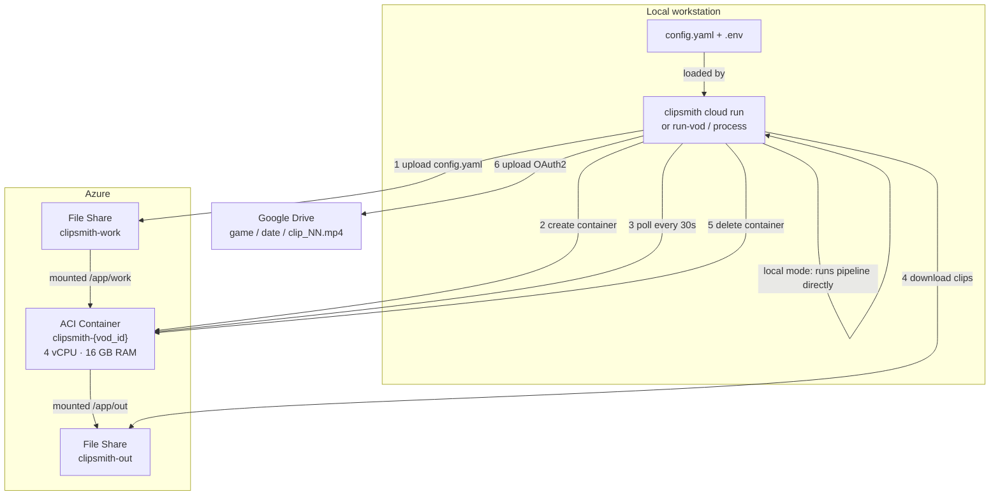
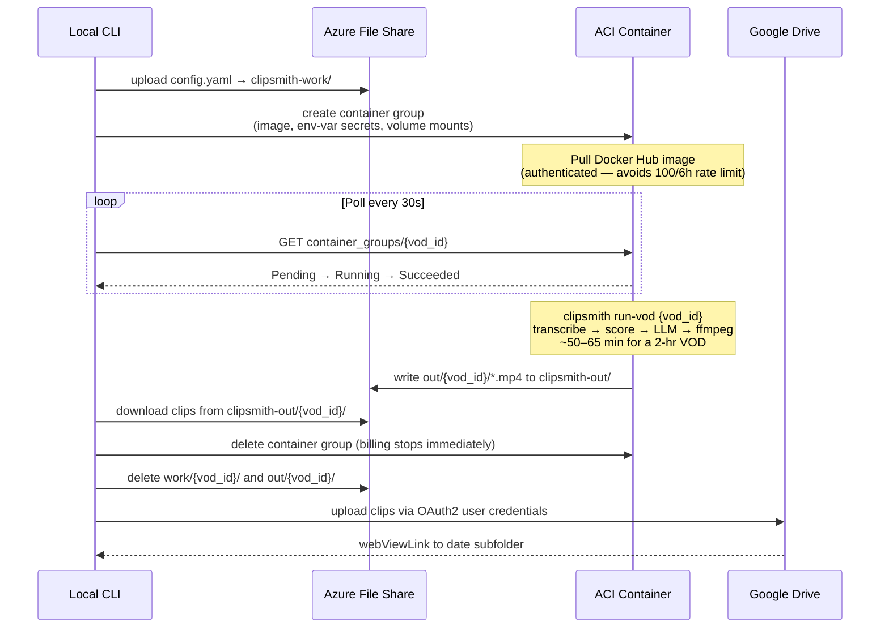
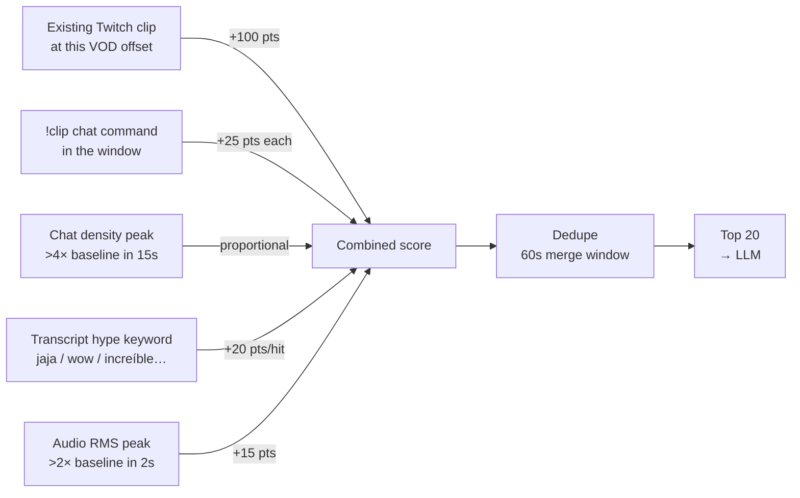
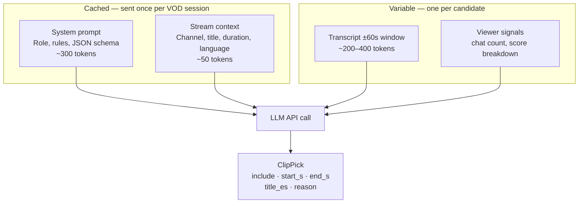

# Architecture

## Overview

clipsmith turns a Twitch VOD (or any local MP4) into a set of 9:16 vertical clips ready for TikTok / YouTube Shorts. There are two execution modes:

- **Local mode** — runs on your workstation; `watch`, `run-vod`, and `process` all feed the same six-stage pipeline
- **Cloud mode** — `clipsmith cloud run` provisions an Azure Container Instance, runs the same pipeline inside Docker, downloads the results, and uploads them to Google Drive — then tears everything down so Azure charges only for active compute time

---

## System Overview



---

## Pipeline Stages

Both local and cloud modes run this same pipeline:

```
VOD (mp4)
    │
    ▼
[1] Webcam Detection ────────── opencv Haar cascade (optional, cached)
    │ webcam_rect.json           fires only when reframe.mode != none
    │                            and webcam_rect not already set in config
    │
    ▼
[2] Transcribe ──────────────── faster-whisper (Spanish, CPU int8)
    │ transcript.json            segments + word timestamps
    │                            chunked + parallel for long VODs
    │
    ▼
[3] Chat Download ──────────── chat-downloader (Twitch replay API)
    │ chat.json                  raw messages → ChatMessage (time, author, emotes)
    │                            fallback: evenly-spaced transcript samples
    │
    ▼
[4] Candidate Scoring ────────  five signals merged & deduped
    │ candidates.json
    │   Signal A: existing Twitch clips  (+100 pts/clip)
    │   Signal B: !clip chat commands    (+25 pts each)
    │   Signal C: chat density peaks     (sliding window, 4× baseline)
    │   Signal D: transcript hype words  (+20 pts/hit)
    │   Signal E: audio RMS peaks        (+15 pts, 2× baseline)
    │
    ▼
[5] LLM Selection ────────────  one API call per candidate (top-20)
    │ picks.json                 returns: include, start_s, end_s, title_es, reason
    │   Providers: Anthropic │ OpenAI │ Ollama
    │
    ▼
[6] Clip Cutting ─────────────  ffmpeg per pick
    out/<vod_id>/               9:16 reframe → optional burned ASS captions
    clip_01_<title>.mp4         stream-copy (none) or libx264/aac (all other modes)

    [manual: clipsmith reframe]
    ▼
[7] Stacked Reframe ──────────  ffmpeg filter_complex (human-in-the-loop)
    out/<vod_id>/stacked/       webcam panel (top) + gameplay panel (bottom)
    clip_01_<title>.mp4         1080×1920, split_ratio configurable
```

---

## Cloud Execution Flow

When you run `clipsmith cloud run <vod_id>`, the full lifecycle is:



---

## Module Map

Each top-level package owns one functional domain. No cross-domain flat imports — every dependency crosses package boundaries explicitly.

```
src/clipsmith/
│
├── cli/                        CLI layer (Typer)
│   ├── __init__.py             App wiring; registers all commands
│   ├── run.py                  Handlers: process, watch, run-vod, whoami
│   ├── clip.py                 Handlers: clip, reframe
│   ├── setup.py                Handlers: setup, check-ollama, detect-webcam
│   ├── cloud.py                Handlers: cloud setup | build | run | status | drive-auth
│   └── utils.py                Config path resolution, timestamp parsing
│
├── pipeline.py                 Orchestrator — wires stages 1–6 in order
│                               transcript-fallback logic when chat is empty
│
├── twitch/                     Twitch integration
│   ├── client.py               Helix API wrapper (httpx): get_user_id, get_videos, get_clips
│   ├── downloader.py           Subprocess wrapper around twitch-dl download
│   ├── chat.py                 GQL chat replay → ChatLog (messages, !clip tags, hype emotes)
│   ├── watcher.py              Daemon: polls Helix every poll_interval_s; emits VodEvent
│   └── state.py                Persists seen VOD IDs to state.json between watcher runs
│
├── transcription/              Whisper transcription
│   └── transcriber.py          faster-whisper → Transcript (segments, words, language)
│                               chunked parallel transcription via ThreadPoolExecutor
│
├── candidates/                 Candidate detection signals
│   ├── builder.py              Merges 5 signals → list[CandidateMoment] sorted by score
│   ├── math.py                 Sliding-window chat density; peak detection math
│   └── audio.py                ffmpeg astats filter → per-window RMS energy; peak detection
│
├── selection/                  LLM-based clip selection
│   └── selector.py             Loops candidates → LLM call → PickResult; clamps duration
│
├── rendering/                  FFmpeg output layer
│   ├── clipper.py              Trim, reframe, optional ASS captions (modes: center/webcam/stacked/none)
│   ├── captions.py             Transcript → ASS subtitle file (karaoke-style Spanish)
│   └── detect.py               Webcam/face detection (OpenCV Haar cascade, optional [vision])
│                               cache-first: writes webcam_rect.json, skips on subsequent runs
│
├── llm/                        LLM provider abstraction
│   ├── base.py                 ClipPicker Protocol, ClipPick dataclass
│   ├── prompts.py              SYSTEM_PROMPT, build_candidate_prompt, build_stream_context
│   ├── anthropic_provider.py   Prompt-cached: system + stream context cached per VOD
│   ├── openai_provider.py      Structured outputs (json_schema); system cached
│   └── ollama_provider.py      Local Ollama (free, no API cost)
│
├── models/                     Pure dataclasses — zero I/O
│   ├── transcript.py           Word, Segment, Transcript
│   ├── candidates.py           CandidateMoment
│   ├── chat.py                 ChatMessage, ChatLog, HYPE_EMOTES
│   └── twitch.py               Video, Clip
│
├── config/                     Configuration layer
│   ├── models.py               Pydantic schema models (AppConfig, ClipConfig, …)
│   └── loaders.py              Secrets (pydantic-settings), load_config, load_secrets
│
├── io/
│   └── media.py                video_duration() via ffprobe — single source of truth
│
├── cloud/                      Azure + Google Drive
│   ├── azure_runner.py         ACI lifecycle: provision, poll, download, teardown
│   └── drive_upload.py         Google Drive OAuth2: folder creation, clip upload
│
└── settings.py                 Re-export shim — backward compat for existing importers
```

---

## Candidate Scoring Detail



| Signal | Source | Score |
|--------|--------|-------|
| Existing Twitch clip at VOD offset | Helix API | +100 pts |
| `!clip` chat command in window | Chat replay | +25 pts each |
| Chat density peak (>4× baseline, 15 s window) | Chat replay | proportional |
| Transcript hype keyword (jaja, wow, etc.) | Transcript | +20 pts/hit |
| Audio RMS energy peak (>2× baseline, 2 s window) | ffmpeg astats | +15 pts |
| Evenly-spaced sample (fallback, no chat data) | Transcript | 1 pt (uniform) |

Candidates within 60 s of each other are merged (highest-score center kept, scores summed). Top 20 by score are sent to the LLM.

---

## LLM Prompt Architecture

Each provider sends **two stable blocks + one variable block** to maximise prompt caching:



`start_s` and `end_s` are **absolute timestamps** from the start of the VOD (not relative offsets).

---

## Reframe Modes

| Mode | Description |
|------|-------------|
| `none` | Stream-copy (no re-encode, no crop) |
| `center` | Center-crop to 9:16, scale to 1080×1920 |
| `webcam` | Crop to `webcam_rect`, scale to 1080×1920 |
| `stacked` | Two-panel: `webcam_rect` on top, `gameplay_rect` on bottom; heights set by `split_ratio` |

The `reframe` command always uses `stacked` mode. The main pipeline uses whatever `reframe.mode` is configured.

### Webcam auto-detection

`rendering/detect.py` samples N evenly-spaced frames (default 20, skipping the first/last 5% of duration), runs an OpenCV Haar frontal-face cascade on each, and clusters detections by IOU ≥ 0.3. The most-frequent cluster is returned as `[x, y, w, h]` in source-video pixels. The result is written to `work/<video_id>/webcam_rect.json` and loaded automatically on subsequent runs.

---

## File Layout

```
clipsmith/
├── config.yaml          behaviour (channels, model sizes, thresholds)
├── .env                 secrets (API keys, Twitch, Azure, Google Drive)
├── state.json           seen VOD IDs (auto-created by watcher)
├── google_oauth_client.json   Google OAuth2 Desktop app credentials (gitignored)
├── work/
│   └── <video_id>/
│       ├── <video_id>.mp4
│       ├── webcam_rect.json    (auto-detected, cached)
│       ├── transcript.json
│       ├── audio_rms.json
│       ├── chat.json
│       ├── candidates.json
│       └── picks.json
└── out/
    └── <video_id>/
        ├── clip_01_<title>.mp4
        ├── clip_01_<title>.ass
        ├── ...
        └── stacked/
            ├── clip_01_<title>.mp4
            └── ...
```

---

## Artifacts

All generated media and intermediate files live outside version control.

### `work/<VOD_ID>/` — scratch space (gitignored)

| File | Produced by | Contents |
|------|-------------|----------|
| `<VOD_ID>.mp4` | `twitch/downloader.py` | Raw VOD download |
| `webcam_rect.json` | `rendering/detect.py` | Auto-detected `[x, y, w, h]` in source pixels |
| `transcript.json` | `transcription/transcriber.py` | Segments + word timestamps |
| `audio_rms.json` | `candidates/audio.py` | Per-window RMS energy series |
| `chat.json` | `twitch/chat.py` | Raw chat messages with timestamps |
| `candidates.json` | `candidates/builder.py` | Scored candidate moments |
| `picks.json` | `selection/selector.py` | LLM decisions (include/skip + clip bounds) |
| `*.ass` | `rendering/captions.py` | ASS subtitle files for each clip |

Each file is written once and re-used on subsequent runs unless `--overwrite` is passed.

### `out/<VOD_ID>/` — final clips (gitignored)

| File | Contents |
|------|----------|
| `clip_NN_<slug>.mp4` | 9:16 vertical clip, 15–30 s |
| `clip_NN_<slug>.ass` | Matching subtitle file |
| `stacked/clip_NN_<slug>.mp4` | Two-panel stacked variant |

### Regenerating outputs

```bash
clipsmith run-vod <VOD_ID>    # full pipeline for a Twitch VOD
clipsmith process <path.mp4>  # same pipeline from a local file
clipsmith clip <VOD_ID>       # re-cuts only (picks.json must exist)
```

`.gitignore` excludes `out/`, `work/`, `*.mp4`, `*.m4a`, `*.ass`, and `*.srt`. No media or artifacts are tracked in git.
