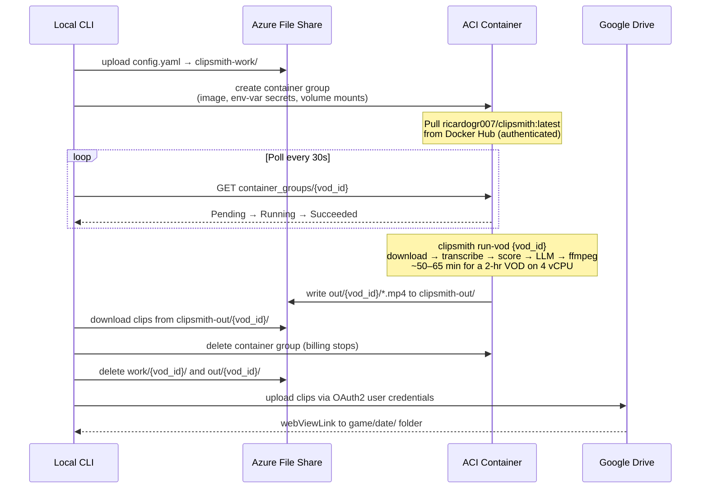

# Cloud Mode

`clipsmith cloud run` provisions an Azure Container Instance, runs the full pipeline inside Docker, downloads the output clips, uploads them to Google Drive, and tears everything down — so Azure charges only for the minutes the container is actually running.

---

## Persistent API Server

The `clipsmith serve` API server runs as a **persistent** ACI instance that stays alive between pipeline runs. The deploy workflow (`deploy.yml`) updates it automatically on every merge to `main`. Bootstrap it once:

```bash
az container create \
  --resource-group clipsmith-rg-dev \
  --name clipsmith-api-dev \
  --image "$ACR_LOGIN_SERVER/clipsmith:latest" \
  --registry-login-server "$ACR_LOGIN_SERVER" \
  --registry-username "$ACR_USERNAME" \
  --registry-password "$ACR_PASSWORD" \
  --cpu 1 \
  --memory 2 \
  --ports 8000 \
  --ip-address Public \
  --restart-policy Always \
  --environment-variables \
    CLIPSMITH_API_KEY="$CLIPSMITH_API_KEY" \
    DATABASE_URL="sqlite:////app/data/clipsmith.db" \
  --azure-file-volume-account-name "$STORAGE_ACCOUNT" \
  --azure-file-volume-account-key "$STORAGE_KEY" \
  --azure-file-volume-share-name clipsmith-work \
  --azure-file-volume-mount-path /app/data
```

After the first bootstrap, `deploy.yml` handles all subsequent updates. The container runs `alembic upgrade head` on every startup before accepting traffic.

---

## Quick Reference

```powershell
# One-time setup (first time only)
clipsmith cloud setup       # verify Azure infra is ready
clipsmith cloud build       # build + push Docker image to Docker Hub
clipsmith cloud drive-auth  # authorize Google Drive (opens browser once)

# Per-VOD run
clipsmith cloud run <vod_id> --game "Game Name" --date 2026-05-03

# Utilities
clipsmith cloud status      # list running ACI jobs
clipsmith cloud run <vod_id> --dry-run   # print ACI spec without provisioning
```

---

## How It Works



### Step by step

1. **`clipsmith cloud run` starts** — loads `config.yaml` and `.env` locally
2. **Config uploaded** — `config.yaml` is pushed to the `clipsmith-work` Azure File Share
3. **Container created** — ACI starts a container using the Docker Hub image; secrets (API keys, Twitch credentials) are injected as secure environment variables; the two file shares are mounted as volumes at `/app/work` and `/app/out`
4. **Pipeline runs inside ACI** — `clipsmith run-vod <vod_id>` executes the full local pipeline. It reads `config.yaml` from `/app/work`, writes intermediate files there, and writes final clips to `/app/out`
5. **Polling** — the local CLI polls the ACI API every 30 seconds until the container state reaches `Succeeded`, `Failed`, or `Stopped`
6. **Download** — clips are downloaded from `clipsmith-out/<vod_id>/` to a local temp directory
7. **Teardown** — the container group is deleted (billing stops immediately); both file share directories are cleaned up
8. **Drive upload** — clips are uploaded to Google Drive under `<root>/<game>/<date>/`; the temp directory is deleted locally

---

## Secrets Inside the Container

Secrets are **never written to disk or stored in the image**. They are injected as ACI environment variables at container-creation time using `secure_value`, which means they appear redacted in the Azure Portal and never show in container logs.

| Environment variable | Source in `.env` |
|---|---|
| `ANTHROPIC_API_KEY` | `ANTHROPIC_API_KEY` |
| `OPENAI_API_KEY` | `OPENAI_API_KEY` |
| `TWITCH_CLIENT_ID` | `TWITCH_CLIENT_ID` |
| `TWITCH_CLIENT_SECRET` | `TWITCH_CLIENT_SECRET` |

Azure storage keys and Docker Hub credentials are used only by the local CLI to set up and communicate with ACI — the container itself accesses storage via the mounted volume filesystem, so it does not need those keys at runtime.

---

## Cost

| Resource | When charged | Typical cost |
|---|---|---|
| ACI CPU (4 vCPU · 16 GB) | Per second of container runtime | ~$0.28 for 60-min run |
| ACI GPU V100 (optional) | Per second of container runtime | ~$1.80 for 60-min run |
| Azure File Share (Standard) | Per GB provisioned per month | < $0.01 (auto-deleted after run) |
| Docker Hub | Free public repo | $0 |
| Google Drive | Free up to 15 GB | $0 |

**Total per 2-hr VOD: ~$0.30** (CPU mode, ~60 min ACI runtime).

GPU mode (set `cloud.gpu_sku: V100` in config) is ~10× faster for transcription but ~6× more expensive per run. At $0.28 vs $1.80, CPU wins unless you're processing many long VODs per day.

---

## Design Decisions

These are the choices made during implementation and why.

### ACI over Spot VMs

| Option | Cost/hr | Provisioning | Eviction risk |
|---|---|---|---|
| **ACI (chosen)** | $0.17 (4 vCPU) | API call, ~10s | None |
| Spot VM D4s v3 | $0.04 | ~3 min | 30s eviction notice |
| Spot VM NC4as T4 v3 | $0.18 | ~3 min | 30s eviction notice |

ACI wins for run-and-die jobs: no provisioning delay, no eviction risk during a 60-minute transcription, and one API call to tear it down. Spot VMs are cheaper per hour but a 30-second eviction notice during transcription would silently discard all progress.

### Azure File Share over Blob Storage

ACI volume mounts support only **Azure File Share**, not Blob Storage. This turned out to be simpler: the container sees `/app/work` and `/app/out` as ordinary filesystem directories — no Azure SDK, no credential plumbing inside the container. The pipeline code runs unchanged; it just reads and writes files.

Blob Storage would have required the container to include the Azure SDK, authenticate with a storage key (another secret to manage inside the container), and replace all `Path.write_text` / `Path.read_bytes` calls with SDK uploads/downloads.

### CPU-only by default (no GPU)

GPU ACI (`V100`, `P100`, `K80`) requires:
- A separate quota increase request from Microsoft (takes 1+ business days)
- A supported region (only a handful of Azure regions have GPU ACI capacity)
- ~6× higher per-minute cost

`faster-whisper` with `compute_type: int8` on 4 vCPU handles a 2-hr VOD in ~50–65 min at $0.28. That's well within tolerable latency for a non-real-time workflow. GPU support is available via `cloud.gpu_sku: V100` in `config.yaml` for anyone who wants it, but CPU is the default.

### Docker Hub with authenticated pulls

Azure IPs share a small anonymous pull rate limit (100 pulls / 6 hours). On busy days, a plain `docker pull` from ACI would fail with a 409 rate-limit error mid-container-creation. Adding `ImageRegistryCredential` to the ACI spec authenticates the pull using a Docker Hub read-only access token — no rate limit applies to authenticated pulls. A read-only token limits blast radius if the credential is ever exposed.

### Whisper model baked into the Docker image

Without model baking, each ACI container startup downloads the Whisper model from HuggingFace (~460 MB for `small`, ~1.5 GB for `medium`). On Azure's network this takes 2–4 minutes and adds latency with no benefit — the model never changes between runs.

Baking it into the image adds ~500 MB to the image size but makes startup instant and predictable. The model download happens once during `clipsmith cloud build` on your local machine.

### OAuth2 user credentials for Google Drive (not service account)

The original implementation used a Google Service Account. This failed immediately in production with `storageQuotaExceeded`:

> Service Accounts do not have storage quota. Leverage shared drives or use OAuth delegation instead.

Service accounts on personal Google accounts have no storage quota — files they upload are owned by the service account, which has no Drive storage allocation. This is a hard Google limitation that cannot be worked around without a Google Workspace subscription.

The fix: **OAuth2 Desktop app credentials**. The user authorizes clipsmith once via a browser (`clipsmith cloud drive-auth`), and the resulting refresh token is saved to `~/.clipsmith_drive_token.json`. Subsequent uploads are made as the real user, counting against the user's 15 GB Drive quota. The token auto-refreshes silently.

### `AzureNamedKeyCredential` instead of `StorageSharedKeyCredential`

The azure-storage-file-share SDK (≥ 12.18) removed `StorageSharedKeyCredential` from the `azure.storage.fileshare` package. The replacement is `AzureNamedKeyCredential` from `azure.core.credentials`, which is the canonical named-key credential for all Azure SDK clients. This is a breaking change in the SDK; any project importing the old class will get an `ImportError` at runtime.

### `DefaultAzureCredential` for ACI management

`DefaultAzureCredential` tries a chain of auth sources in order: environment variables → workload identity → managed identity → Azure CLI → browser. For local use, `az login` is sufficient — no service principal or managed identity setup is required. In a CI/CD environment, setting `AZURE_CLIENT_ID`, `AZURE_CLIENT_SECRET`, and `AZURE_TENANT_ID` in environment variables makes the same code work without modification.

---

## Monitoring a Running Job

Each run creates an ephemeral resource group named `rg-clipsmith-<vod_id_prefix>-<unix_ts>`.
The `clipsmith cloud run` output prints the exact name when provisioning completes — copy it
from there. You can also list all active jobs:

```powershell
clipsmith cloud status
```

To tail container logs from another terminal, substitute the resource group and container group
names from the run output:

```powershell
az container logs `
  --resource-group rg-clipsmith-<vod_id_prefix>-<unix_ts> `
  --name clipsmith-<vod_id> `
  --container-name clipsmith `
  --follow
```

Or watch in the Azure Portal:

1. Portal → **Container instances** → `clipsmith-<vod_id>`
2. **Containers** tab → select `clipsmith` → **Logs**

The container prints the same log output as a local `clipsmith run-vod -v` run.

---

## Troubleshooting

| Error | Cause | Fix |
|---|---|---|
| `ImportError: cannot import name 'StorageSharedKeyCredential'` | Old azure-storage-file-share SDK | Use `AzureNamedKeyCredential` from `azure.core.credentials` (already fixed in this repo) |
| `ClientAuthenticationError: DefaultAzureCredential failed` | Not logged into Azure CLI | Run `az login` |
| `HTTP 409 RegistryErrorResponse` from Docker Hub | Anonymous pull rate limit on Azure IPs | Set `DOCKER_HUB_USERNAME` and `DOCKER_HUB_PASSWORD` (read-only access token) in `.env` |
| `storageQuotaExceeded` on Google Drive upload | Service account has no Drive quota | Run `clipsmith cloud drive-auth` to switch to OAuth2 user credentials |
| `access_denied` during Drive OAuth | Account not added as test user | Google Cloud Console → OAuth consent screen → Test users → add your email |
| `UnicodeEncodeError: charmap codec` | Windows cp1252 console, non-ASCII in Rich output | Avoid `✓`, `→`, `—` in any Rich-formatted console output on Windows |
| ACI container stays in `Pending` > 5 min | Image pull failing silently | Check Docker Hub credentials and image name in `config.yaml` |

---

## Running the Cloud Smoke Tests

Two end-to-end tests in `tests/e2e/test_cloud.py` provision real Azure resources, verify
reachability, and tear everything down. They are skipped by default — both the `--run-e2e`
flag and `AZURE_SUBSCRIPTION_ID` being set are required.

**Local dev** (requires `az login` first):

```powershell
# Install cloud deps if not already installed
pip install -e ".[dev,cloud]"

# Run the two cloud smoke tests
$env:AZURE_SUBSCRIPTION_ID = "<your-subscription-id>"
python -m pytest tests/e2e/test_cloud.py --run-e2e -v
```

Expected output: 2 tests pass in roughly 3–6 minutes (storage account provisioning takes
30–90 s per test).

**CI** — the `e2e-cloud` job in `.github/workflows/ci.yml` runs on `workflow_dispatch` and
nightly `schedule`. It needs `AZURE_SUBSCRIPTION_ID` set as a GitHub Actions repository
secret. If the runner lacks ambient Azure credentials, also add `AZURE_CLIENT_ID`,
`AZURE_TENANT_ID`, and `AZURE_CLIENT_SECRET` as secrets — `DefaultAzureCredential` picks
them up automatically without any code change.

**What the tests verify:**

| Test | Checks |
|---|---|
| `test_cloud_provision_and_teardown` | Resource group and storage account are created with correct names; resource group is gone after teardown |
| `test_cloud_file_share_roundtrip` | `clipsmith-work` share accepts a file upload and returns exact bytes on download; `clipsmith-out` share is reachable |

---

## Prerequisites

See [Azure Cloud Setup](dev/azure-cloud-setup.md) for the full one-time provisioning walkthrough covering:

- Azure CLI login and resource group creation
- Storage account and file share provisioning
- Docker Hub repository and access token
- Google Cloud project, Drive API, and OAuth2 Desktop app credentials

---

## Service Principal (Recommended)

> **TODO:** SP creation requires Global Admin rights on the Azure AD tenant. If your subscription
> is linked to an organization tenant (e.g. a university or company), IT policy may block app
> registration. In that case, use `az login` as the fallback — `DefaultAzureCredential` picks it
> up automatically and everything works. Revisit this section if you migrate to a personal
> subscription (your own `@outlook.com`/`@hotmail.com` tenant), where you are the Global Admin.
> The role definition is already committed at `infra/clipsmith-runner-role.json` — setup is a
> two-command operation once you have a tenant you control.

By default `DefaultAzureCredential` falls back to `az login`, meaning clipsmith runs as your
personal admin account. It is better to use a dedicated Service Principal with a least-privilege
custom role so clipsmith can only do what it needs to do.

**One-time setup (requires Global Admin on the Azure AD tenant):**

```powershell
$sub = $env:AZURE_SUBSCRIPTION_ID

# 1. Create the custom role from the committed definition
(Get-Content infra/clipsmith-runner-role.json) `
  -replace 'SUBSCRIPTION_ID_PLACEHOLDER', $sub |
  az role definition create --role-definition '@-'

# 2. Create the service principal and assign the custom role
az ad sp create-for-rbac `
  --name "clipsmith-runner" `
  --role "Clipsmith Runner" `
  --scopes /subscriptions/$sub `
  --json-auth
```

The `--json-auth` flag prints a JSON block. Copy the values into `.env`:

```dotenv
AZURE_CLIENT_ID=<clientId>
AZURE_CLIENT_SECRET=<password>
AZURE_TENANT_ID=<tenant>
```

`DefaultAzureCredential` picks up these env vars automatically as its first credential source —
no `az login` needed for clipsmith after this point. The role (`infra/clipsmith-runner-role.json`)
grants only the permissions clipsmith actually uses across Resource Groups, Storage, and ACI.

**Verify:**

```powershell
clipsmith cloud setup   # should print "Azure credentials valid" — as clipsmith-runner, not you
```

After a cloud run, Azure Portal → Monitor → Activity Log will show `clipsmith-runner` as the
initiating identity instead of your personal email.
